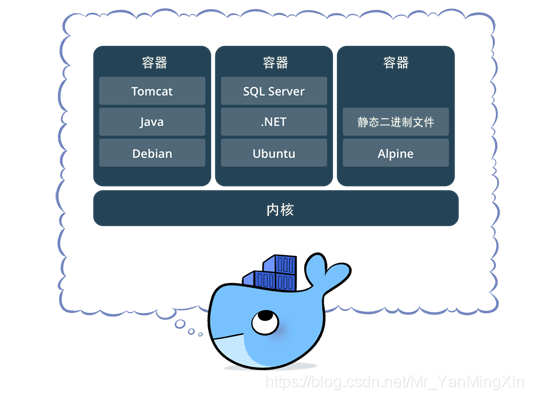

[toc]

# Docker概述

<https://jiajially.gitbooks.io/dockerguide/content/index.html>

## Docker为什么出现？

对于一款产品，从开发到上线，其间处于两套不同的环境！这其中的环境和配置比较复杂。如，每台计算机都需要部署环境(集群Redis、Hadoop...)

从开发到部署到 Linux 上，需要两部分人配合，过程繁杂。

为了能够一同打包部署上线，Docker 给出了解决方案。

## Docker的思想

>   Docker 是一个用于开发，交付和运行应用程序的开放平台。
>
>   Docker 使您能够将应用程序与基础架构分开，从而可以快速交付软件。
>
>   借助 Docker，您可以与管理应用程序相同的方式来管理基础架构。
>
>   通过利用 Docker 的方法来快速交付，测试和部署代码，您可以大大减少编写代码和在生产环境中运行代码之间的延迟。
>
>   Docker 的思想来自于集装箱。Docker 通过**隔离**机制，应用之间相互隔离，互不影响。通过隔离机制，可以将服务器利用到机制。

## Docker的历史

> 2010年，有一群搞 IT 的年轻人，在美国成立了一家公司`DotCloud`。做一些 `PaaS 云计算服务！LXC(Linux Containers：Linux 容器项目)`有关的容器技术！
>
> 他们将其容器化技术，进行了统一化命名：Docker!
>
> Docker 诞生初期并没有引起行业的注意。因此他们选择了开源(2013年)。之后越来越多人发现了 Docker 的优点。Docker 火了。
>
> 之后每个月 Docker 都会更新一个版本。
>
> 2014年4月9号，Docker1.0 发布。
>
> Docker 为什么这么火？它十分轻巧！
>
> 在容器技术出来之前，我们都是使用的虚拟机技术(如：VMware)
>
> 虚拟机的使用：在 Windows 中安装虚拟机软件(VMware)，通过这个软件，可以虚拟出一台或多台电脑！但是使用虚拟机十分笨重。
>
> 虚拟机属于虚拟化技术，Docker 容器技术，也属于虚拟化技术。

虚拟机：全盘安装，大而繁琐。

Docker：镜像(Linux最核心的环境 + jdk + mysql)，简单安装，十分小巧。

## Docker 有关地址

> Docker 基于 Golang 语言开发的。
>
> Docker 官网：<https://www.docker.com>
>
> Docker 文档地址：<https://docs.docker.com/>
>
> Docker 仓库地址：<https://hub.docker.com/>

## Docker 能做什么？

### 虚拟机技术：

> 虚拟化技术是一种资源管理技术，是将计算机的各种实体资源（CPU、内存、磁盘空间、网络适配器等），予以抽象、转换后呈现出来并可供分割、组合为一个或多个电脑配置环境。
>
> 由此，打破实体结构间的不可切割的障碍，使用户可以比原本的配置更好的方式来应用这些电脑硬件资源。
>
> 这些资源的新虚拟部分是不受现有资源的架设方式，地域或物理配置所限制。
>
> 一般所指的虚拟化资源包括计算能力和数据存储。

#### 虚拟机技术的缺点：

> ​	1. 资源占用多；
> ​	2. 冗余步骤多；
> ​	3. 启动慢。

### 容器化技术：

> 一句话概括容器：容器就是将软件打包成标准化单元，以用于开发、交付和部署。
>
> 容器镜像是轻量的、可执行的独立软件包。包含软件运行所需的所有内容：代码、运行时环境、系统工具、系统库和设置。
>
> 容器化软件适用于基于 Linux 和 Windows 的应用，在任何环境中都能够始终如一地运行。
>
> 容器赋予了软件独立性，使其免受外在环境差异（例如，开发和预演环境的差异）的影响，从而有助于减少团队间在相同基础设施上运行不同软件时的冲突。

​	不是模拟模拟一个完整的操作系统。

### Docker 与 虚拟机技术的不同：

- 传统虚拟机，通过虚拟一块硬件，运行一个完整的操作系统，之后在这上面安装和运行软件。
- 容器内的应用直接运行在宿主机上，容器没有自己的内核，也没有虚拟出的硬件，所以更轻便。
- 每个容器间相互隔离，每个容器都有一个属于自己的文件系统，互不影响。

### Docker 基于 LXC 虚拟容器技术
Docker 技术是基于 LXC（Linux container- Linux 容器）虚拟容器技术的。

> LXC，其名称来自 Linux 软件容器（Linux Containers）的缩写，一种操作系统层虚拟化（Operating system–level virtualization）技术，为 Linux 内核容器功能的一个用户空间接口。它将应用软件系统打包成一个软件容器（Container），内含应用软件本身的代码，以及所需要的操作系统核心和库。通过统一的名字空间和共用 API 来分配不同软件容器的可用硬件资源，创造出应用程序的独立沙箱运行环境，使得 Linux 用户可以容易的创建和管理系统或应用容器。

LXC 技术主要是借助 Linux 内核中提供的 CGroup 功能和 name space 来实现的，通过 LXC 可以为软件提供一个独立的操作系统运行环境。

#### cgroup 和 namespace 介绍：

> namespace 是 Linux 内核用来隔离内核资源的方式。 通过 namespace 可以让一些进程只能看到与自己相关的一部分资源，而另外一些进程也只能看到与它们自己相关的资源，这两拨进程根本就感觉不到对方的存在。具体的实现方式是把一个或多个进程的相关资源指定在同一个 namespace 中。Linux namespaces 是对全局系统资源的一种封装隔离，使得处于不同 namespace 的进程拥有独立的全局系统资源，改变一个 namespace 中的系统资源只会影响当前 namespace 里的进程，对其他 namespace 中的进程没有影响。

（以上关于 namespace 介绍内容来自https://www.cnblogs.com/sparkdev/p/9365405.html ，更多关于 namespace 的呢内容可以查看这篇文章 ）。

> CGroup 是 Control Groups 的缩写，是 Linux 内核提供的一种可以限制、记录、隔离进程组 (process groups) 所使用的物力资源 (如 cpu memory i/o 等等) 的机制。

（以上关于 CGroup 介绍内容来自 https://www.ibm.com/developerworks/cn/linux/1506_cgroup/index.html ，更多关于 CGroup 的呢内容可以查看这篇文章 ）。

#### cgroup 和 namespace 两者对比：

> 两者都是将进程进行分组，但是两者的作用还是有本质区别。namespace 是为了隔离进程组之间的资源，而 cgroup 是为了对一组进程进行统一的资源监控和限制。

### 对于 DevOps（开发、运维）

#### 所能做的事：

- 应用
