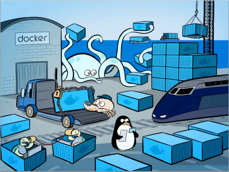

[toc]

# Docker 概述

## Docker 为什么出现？

> ​	2013年2月，前 Gluster 的 CEO Ben Golub 和 dotCloud 的 CEO Solomon Hykes 坐在一起聊天时，Solomon谈到想把 dotCloud 内部使用的 Container 容器技术单独拿出来开源，然后围绕这个技术开一家新公司提供技术支持。
>
> ​	28 岁的 Solomon 在使用 python 开发 dotCloud 的 PaaS云 时发现，使用 LXC（Linux Container：Linux 容器项目）技术可以打破产品发布过程中应用工程师和系统工程师两者之间无法轻松协作发布产品的难题。
>
> ​	这个 Container容器技术 可以把开发者从日常部署的繁杂工作中解脱出来，让开发者能专心写好程序；从系统工程师到角度来看也是一样的，他们迫切需要从各种混乱的部署中解脱出来，让系统工程师专注在应用的水平扩展、稳定发布的解决方案上。
>
> ​	他们深入交谈，觉得这是一次云技术的变革，紧接着在 2013 年 3 月 Docker0.1 发布，拉开来基于云计算平台发布产品方式的变革序幕。

## Docker 的思想

>   ​	Docker 提供了在称为容器的松散隔离环境中打包和运行应用程序的能力。
>
>   ​	隔离和安全性允许您在给定主机上同时运行多个容器。
>
>   ​	容器是轻量级的，包含运行应用程序所需的一切，因此您无需依赖主机上当前安装的内容。
>   ​	您可以在工作时轻松共享容器，并确保与您共享的每个人都获得以相同方式工作的同一个容器。
>
>   Docker 提供工具和平台来管理容器的生命周期：
>
>   - 使用容器开发您的应用程序及其支持组件。
>   - 容器成为分发和测试应用程序的单元。
>   - 准备就绪后，将应用程序部署到生产环境中，作为容器或编排的服务。无论您的生产环境是本地数据中心、云提供商还是两者的混合，这都是一样的。
>
>   ​	Docker 的思想来自于集装箱。Docker 通过**隔离**机制，应用之间相互隔离，互不影响。通过隔离机制，可以将服务器利用到机制。

> ​	Docker 是一个开源的应用容器引擎，让开发者可以打包他们的应用以及依赖包到一个可移植的容器中，然后发布到任何流行的 Linux 机器上，也可以实现虚拟化。
>
> ​	容器是完全使用__沙箱机制__，*相互之间不会有任何接口（类似 iPhone 的 app）*。 *几乎没有性能开销,可以很容易地在机器和数据中心中运行*。最重要的是,*他们不依赖于任何语言、框架包括系统*。

## Docker 有关地址

> ​	Docker 基于 Golang 语言开发的。
>
> ​	Docker 官网：<https://www.docker.com>
>
> ​	Docker 文档地址：<https://docs.docker.com/>
>
> ​	Docker 仓库地址：<https://hub.docker.com/>
>
> ​	Docker 简明教程：<https://jiajially.gitbooks.io/dockerguide/content/index.html>

## Docker 能做什么？

### 解决环境管理复杂：

> ​	从各种OS到各种中间件再到各种App，一款产品能够成功发布，作为开发者需要关心的东西太多，且难于管理，这个问题在软件行业中普遍存在并需要直接面对。
>
> ​	Docker可以简化部署多种应用实例工作，比如Web应用、后台应用、数据库应用、大数据应用比如Hadoop集群、消息队列等等都可以打包成一个image部署。如下图所示：

### 云时代的到来：

> ​	AWS 的成功，引到开发者将应用转移到云上，解决来硬件管理的问题，然而软件配置和管理相关的问题依然存在。Docker 的出现正好能帮助软件开发者开阔思路，尝试新的软件管理方法来解决这个问题。

### 虚拟化手段的变化：

> ​	云时代采用标配硬件来降低成本，采用虚拟化手段来满足用户按需分配的资源需求以及保证可用性和隔离性。
>
> ​	然而无论是KVM还是Xen，在Docker卡来都是在浪费资源，因为用户需要的是高校运行环境而非OS，GuestOS即浪费资源，又难于管理，更加轻量级大LXC更佳灵活和快速：

### LXC的便携性: 

> ​	LXC在 Linux 2.6 的 Kernel 里就已经存在了，但是其设计之初并非为云计算考虑的，缺少标准化的描述手段和容器的可便携性，决定其构建出的环境难于分发和标准化管理(相对于KVM之类image和snapshot的概念)。Docker就在这个问题上做出了实质性的创新方法。

## 虚拟技术与容器化技术

### 虚拟机技术：

> 虚拟化技术是一种资源管理技术，是将计算机的各种实体资源（CPU、内存、磁盘空间、网络适配器等），予以抽象、转换后呈现出来并可供分割、组合为一个或多个电脑配置环境。
>
> 由此，打破实体结构间的不可切割的障碍，使用户可以比原本的配置更好的方式来应用这些电脑硬件资源。
>
> 这些资源的新虚拟部分是不受现有资源的架设方式，地域或物理配置所限制。
>
> 一般所指的虚拟化资源包括计算能力和数据存储。

#### 虚拟机技术的缺点：

> 	1. 资源占用多；
> ​	2. 冗余步骤多；
> ​	3. 启动慢。

### 容器化技术：

> 一句话概括容器：容器就是将软件打包成标准化单元，以用于开发、交付和部署。
>
> 容器镜像是轻量的、可执行的独立软件包。包含软件运行所需的所有内容：代码、运行时环境、系统工具、系统库和设置。
>
> 容器化软件适用于基于 Linux 和 Windows 的应用，在任何环境中都能够始终如一地运行。
>
> 容器赋予了软件独立性，使其免受外在环境差异（例如，开发和预演环境的差异）的影响，从而有助于减少团队间在相同基础设施上运行不同软件时的冲突。

​	不是模拟模拟一个完整的操作系统。

### Docker 与 虚拟机技术的不同：

- 传统虚拟机，通过虚拟一块硬件，运行一个完整的操作系统，之后在这上面安装和运行软件。
- 容器内的应用直接运行在宿主机上，容器没有自己的内核，也没有虚拟出的硬件，所以更轻便。
- 每个容器间相互隔离，每个容器都有一个属于自己的文件系统，互不影响。

### Docker 基于 LXC 虚拟容器技术
Docker 技术是基于 LXC（Linux container- Linux 容器）虚拟容器技术的。

> LXC，其名称来自 Linux 软件容器（Linux Containers）的缩写，一种操作系统层虚拟化（Operating system–level virtualization）技术，为 Linux 内核容器功能的一个用户空间接口。它将应用软件系统打包成一个软件容器（Container），内含应用软件本身的代码，以及所需要的操作系统核心和库。通过统一的名字空间和共用 API 来分配不同软件容器的可用硬件资源，创造出应用程序的独立沙箱运行环境，使得 Linux 用户可以容易的创建和管理系统或应用容器。

LXC 技术主要是借助 Linux 内核中提供的 CGroup 功能和 name space 来实现的，通过 LXC 可以为软件提供一个独立的操作系统运行环境。

#### cgroup 和 namespace 介绍：

> namespace 是 Linux 内核用来隔离内核资源的方式。 通过 namespace 可以让一些进程只能看到与自己相关的一部分资源，而另外一些进程也只能看到与它们自己相关的资源，这两拨进程根本就感觉不到对方的存在。具体的实现方式是把一个或多个进程的相关资源指定在同一个 namespace 中。Linux namespaces 是对全局系统资源的一种封装隔离，使得处于不同 namespace 的进程拥有独立的全局系统资源，改变一个 namespace 中的系统资源只会影响当前 namespace 里的进程，对其他 namespace 中的进程没有影响。

（以上关于 namespace 介绍内容来自https://www.cnblogs.com/sparkdev/p/9365405.html ，更多关于 namespace 的呢内容可以查看这篇文章 ）。

> CGroup 是 Control Groups 的缩写，是 Linux 内核提供的一种可以限制、记录、隔离进程组 (process groups) 所使用的物力资源 (如 cpu memory i/o 等等) 的机制。

（以上关于 CGroup 介绍内容来自 https://www.ibm.com/developerworks/cn/linux/1506_cgroup/index.html ，更多关于 CGroup 的呢内容可以查看这篇文章 ）。

#### cgroup 和 namespace 两者对比：

> 两者都是将进程进行分组，但是两者的作用还是有本质区别。namespace 是为了隔离进程组之间的资源，而 cgroup 是为了对一组进程进行统一的资源监控和限制。

