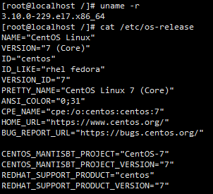

[toc]

# Docker 安装

## Docker 基本组成


### 镜像(images)：

> Docker 镜像就如一个模板，可以通过这个模板来创建容器服务。
>
> 如：
> 	tomcat 镜像 -> run(启动镜像) -> tomcatd容器(用来提供服务器)
>
> 通过这个镜像，能够创建多个容器（最终服务运行或项目运行就是在容器中）。

### 容器(Containers):

> Docker 利用容器技术，能够独立运行一个或一组应用，这是通过镜像创建的。可以将容器理解为一个简易的 Linux 系统。
>
> 容器具有启动、停止、删除等基本指令。

### 仓库(Repository):

> 仓库是用来存放镜像的地方。仓库分为公有仓库和私有仓库。
>
> 官方仓库：Docker Hub。国内有阿里云等容器服务器，需要我们配置镜像加速。

## 从仓库安装

### 安装前准备

#### 环境查看

~~~shell
uname -r
// 查看系统环境
cat /etc/os-release
~~~



### 安装

#### 1. 卸载旧版本

~~~shell
sudo yum remove docker docker-client docker-client-latest docker-common docker-latest docker-latest-logrotate docker-logrotate docker-engine
~~~

#### 2. 安装必要的安装包

*安装 yum-utils 包(提供 yum-config-manager 实用程序)，并设置仓库。*

~~~shell
sudo yum install -y yum-utils
~~~

#### 3. 设置镜像的仓库(存储库)

```shell
 sudo yum-config-manager \
    --add-repo \
    http://mirrors.aliyun.com/docker-ce/linux/centos/docker-ce.repo
    
 sudo yum-config-manager \
    --add-repo \
    https://download.docker.com/linux/centos/docker-ce.repo	# 默认是国外的
```

#### 4. 更新 yum 软件包索引

```shell
yum makecache fast
```

#### 5. 安装 Docker

```shell
sudo yum install -y docker-ce docker-ce-cli containerd.io docker-compose-plugin
```

##### 安装说明

| 参数                  | 说明                                                         |
| --------------------- | ------------------------------------------------------------ |
| docker-ce             | Docker 引擎(社区版)                                          |
| docker-ce-cli         | Docker 引擎的命令行界面(社区版)                              |
| containerd.io         | 守护进程 containerd。它在 docker 包上独立工作，并且是 docker 包所必需的 |
| docker-compose-plugin | docker-compose 插件                                          |

​	此命令会安装 Docker，但不会启动 Docker。它还会创建一个`docker`组，但是默认情况下它不会将任何用户添加到该组中。

#### 6. 启动 Docker

```shell
sudo systemctl start docker
// 一般用户权限不够，需要使用 sudo 获取 root 权限。
```

##### 查看 Docker 版本

```shell
sudo docker version
```

#### 7.`hello-world`：通过运行映像来验证 Docker 引擎是否已正确安装。

```shell
sudo docker run hello-world
```

### 配置阿里云镜像加速

网址：<https://cr.console.aliyun.com/cn-hangzhou/instances>

#### 配置镜像

```shell
sudo mkdir -p /etc/docker

sudo tee /etc/docker/daemon.json <<-'EOF'
{
  "registry-mirrors": ["https://ic5gzmo7.mirror.aliyuncs.com"]
}
EOF

sudo systemctl daemon-reload

sudo systemctl restart docker
```

#### 加速器

| 加速器地址                             |
| -------------------------------------- |
| <https://ic5gzmo7.mirror.aliyuncs.com> |

## 从包安装

### 安装

#### 1. 下载 Docker

​	前往 <https://download.docker.com/linux/centos/> 并选择 CentOS 版本。然后浏览x86_64/stable/Packages/ 并下载 .rpm 要安装的 Docker 版本的文件。

#### 2. 安装 Docker

​	安装 Docker Engine，将下面的路径更改为您下载 Docker 包的路径。

```shell
sudo yum install /path/to/package.rpm
```

​	此命令会安装 Docker，但不会启动 Docker。它还会创建一个 `docker`组，但是默认情况下它不会将任何用户添加到该组中。

#### 3. 启动 Docker

```shell
sudo systemctl start docker
```

####  4.`hello-world`：通过运行映像来验证 Docker 引擎是否已正确安装。

```shell
sudo docker run hello-world
```

# Docker 卸载

## 卸载

### 卸载 Docker Engine、CLI、Containerd 和 Docker Compose 软件包

```shell
sudo yum remove docker-ce docker-ce-cli containerd.io docker-compose-plugin
```

### 主机上的映像、容器、卷或自定义配置文件不会自动删除。要删除所有映像、容器和卷

```shell
sudo rm -rf /var/lib/docker
sudo rm -rf /var/lib/containerd
```

#### 注：

> ​	**必须手动删除任何已编辑的配置文件。**
