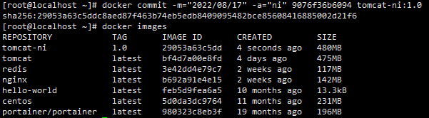

[toc]

# 提交自己的镜像

## commit image

> ​	提交自己的镜像。从容器的文件更改或设置创建一个新的镜像。

### 命令

```shell
docker commit -m="提交的描述信息" -a="作者" <container_id> [repository[:tag]]
```

## 案例

> 1. 启动默认的 tomcat 镜像。
> 2. 对该 tomcat 镜像进行修改。
> 3. 将其提交。
>    类似于 git 中的 commit，并不会提交到远程仓库中，只是提交到本地仓库。


