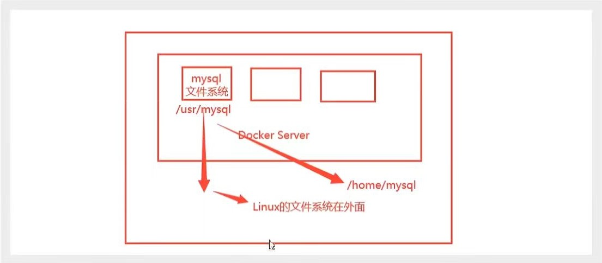
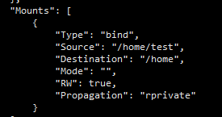

[toc]

# 容器数据卷

## 什么是容器数据卷？

> ​	*问题引出：*
>
> ​		我们知道，Docker 是将应用和其运行环境打包成一个镜像的。从镜像中运行起一个容器。如果我们同时也将数据保存在容器之中，当我们关闭容器时，容器里的数据也会丢失！因此，我们希望我们的*__<span style="color: red">数据能够得到持久化存储</span>__*。
>
> ​		就如，我们通过 MySQL 镜像创建一个 MySQL 容器(MySQL01)，当我们将 MySQL01 删除之后，容器里的表等内容也被删了！因此，*<span style="color: red">MySQL 的数据能够保存到本地(Linux)</span>*。
>
> ​	*因此：*
>
> ​		容器之间需要一个*<span style="color: red">数据共享的技术，使得 Docker 容器中产生的数据，也能够同步到本地</span>*。
>
> ​		这就是*__<span style="color: red">卷技术</span>__*。也即*<span style="color: red">目录的挂载</span>*，<span style="color: green">将我们容器里的目录，挂载到里 Linux 上。</span>(同步机制)



### 卷技术：

**<u>*容器的持久化和同步操作。容器间也可进行数据共享！*</u>**

## 容器卷的使用

### 方式一：使用命令挂载 -v

```shell
docker run -it -v 主机目录:容器内目录 <container_id> bashShell

// eg:
docker run -it -v /home/test:/home centos01 /bin/bash
```

#### 参数说明

| 参数 | 说明                                                         |
| ---- | ------------------------------------------------------------ |
| -it  | 使用交互方式运行                                             |
| -v   | 指定容器的目录。如：/home/test:/home<br />-v 主机目录:容器目录<br />-v 容器目录 |



#### 双向绑定

> 不论是主机内还是容器内的变化，都会同步到另一方。

## 匿名挂载与具名挂载

### 匿名挂载

> ​	在 -v 时，只指定了容器内的路径，没有指定容器外(Linux)的路径。

#### 具体使用

```shell
docker run -d -p 3306:3306 -v /etc/mysql mysql:5.7
```

#### 使用情况

```shell
docker volume ls
DRIVER    VOLUME NAME
local     08af196fafb81cb0dbe2bae775cb4bdf15353c4ec494addd310728fbccbb3c1d
```

### 具名挂载

> ​	在 -v 时，通过 卷名:容器内路径
>
> ​	在所有的 Docker 容器内的卷，没有指定目录的情况下都是在`/var/lib/docker/volumes/`下。
>
> ​	我们可以通过具名挂载的方式，方便我们找到卷，大多情况下使用的`具名挂载`。

#### 具体使用

```shell
docker run -d -p 8080:80 --name nginx02 -v juming-nginx:/etc/nginx nginx
```

#### 使用情况

```shell
docker volume ls
DRIVER    VOLUME NAME
local     juming-nginx

[root@localhost ~]# docker volume inspect juming-nginx
[
    {
        "CreatedAt": "2022-08-18T11:46:47+08:00",
        "Driver": "local",
        "Labels": null,
        "Mountpoint": "/var/lib/docker/volumes/juming-nginx/_data",
        "Name": "juming-nginx",
        "Options": null,
        "Scope": "local"
    }
]

```

### 如何区分 匿名挂载、具名挂载和指定路径挂载？

> ​	-v 容器内路径				// 匿名挂载
>
> ​	-v 卷名：容器内路径		   // 具名挂载
>
> ​	-v /宿主机路径:容器内路径	  // 指定路径挂载

### ro 与 rw

> ​	挂载一般默认是 `rw(readwrite)`，从容器中与主机都能够进行读取与修改。
>
> ​	`ro(readonly)`：只读。
> ​		我们只能够通过宿主机来进行操作容器，容器内无法操作。

```shell
docker run -d -P --name nginx01 -v juming-nginx:/etc/nginx:rw nginx

docker run -d -P --name nginx01 -v juming-nginx:/etc/nginx:rw nginx
```

