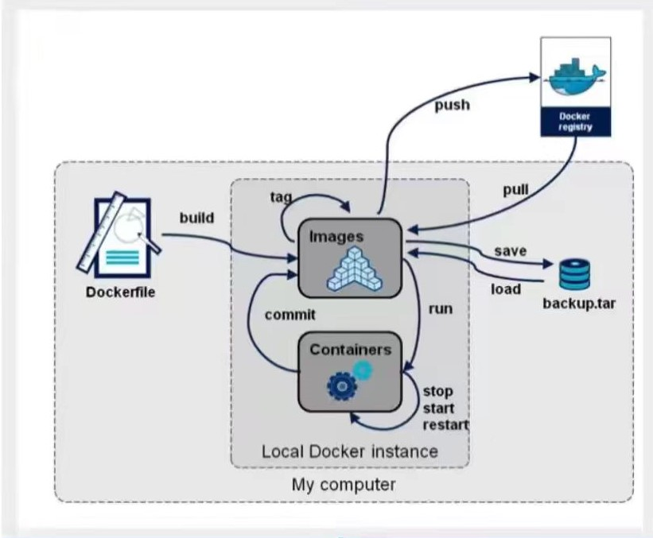

[toc]

# DockerFile

> ​	Dockerfile 是一个用来构建镜像的文本文件，文本内容包含了一条条构建镜像所需的指令和说明。
>
> ​	DockerFile 是面向开发的。



## DockerFile 构建步骤：

1. 编写一个 dockerfile 文件：

   ```shell
   vim /home/dockerfile-test/dockerfile
   ```
   ```shell
   FROM centos:7
   MAINTAINER nishi<123@163.com>
   
   ENV MYPATH /usr/local
   
   WORKDIR $MYPATH
   
   RUN yum install -y vim
   RUN yum install -y net-tools
   
   EXPOSE 80
   
   CMD echo MYPATH
   CMD echo "end..."
   CMD /bin/bash
   ```
   
2. docker build 构建一个镜像：

   ```shell
   docker build -f /home/dockerfile-test/dockerfile -t centos:1.1 .
   ```

3. docker run 运行镜像：

   ```shell
   docker run -it --name centos02 centos:1.1
   ```

4. docker push 发布镜像：

### centos镜像：

```shell
FROM scratch
ADD centos-7-x86_64-docker.tar.xz /

LABEL \
    org.label-schema.schema-version="1.0" \
    org.label-schema.name="CentOS Base Image" \
    org.label-schema.vendor="CentOS" \
    org.label-schema.license="GPLv2" \
    org.label-schema.build-date="20201113" \
    org.opencontainers.image.title="CentOS Base Image" \
    org.opencontainers.image.vendor="CentOS" \
    org.opencontainers.image.licenses="GPL-2.0-only" \
    org.opencontainers.image.created="2020-11-13 00:00:00+00:00"

CMD ["/bin/bash"]
```

## DockerFile 命令

- FROM- 基础镜像(基于哪个镜像来构建镜像)。

- MAINTAINER- 镜像维护者信息。(姓名+邮箱)。

- RUN- 构建镜像执行的命令，每一次 RUN 都会构建一层。

- CMD- 容器启动的命令。如果有多个则以最后一个为准(可被替代)，也可以为 ENTRYPOINT 提供参数。

- VOLUME- 定义数据卷，如果没有定义则使用默认。指定容器挂载点到宿主机自动生成的目录或其他容器。

- USER- 指定后续执行的用户和用户组。

- WORKDIR- 为 RUN、CMD、ENTRYPOINT、COPY 和 ADD 设置工作目录，就是当进入到容器中所切换进入的目录。

- HEALTHCHECH- 健康检测指令

- ARG- 变量属性值，但不在容器内部起作用

- EXPOSE- 指定对外的端口。

- ENV- 设置容器环境变量，容器内部也会起作用。

- ADD- 添加文件或目录到容器中，如果是URL或压缩包便会自动下载或自动解压。

- COPY- 添加文件，以复制的形式。

- ENTRYPOINT- 容器进入时执行的命令(可以追加命令)。
- ONBUILD- 用于延迟构建命令的执行。简单的说，就是 Dockerfile 里用 ONBUILD 指定的命令，在本次构建镜像的过程中不会执行（假设镜像为 test-build）。当有新的 Dockerfile 使用了之前构建的镜像 FROM test-build ，这时执行新镜像的 Dockerfile 构建时候，会执行 test-build 的 Dockerfile 里的 ONBUILD 指定的命令。

### CMD 与 ENTRYPOINT 的区别：

| 命令       | 说明                                                         |
| ---------- | ------------------------------------------------------------ |
| CMD        | 容器启动的命令。如果有多个则以最后一个为准(可被替代)，也可以为 ENTRYPOINT 提供参数。 |
| ENTRYPOINT | 容器进入时执行的命令(可以追加命令)。                         |

#### CMD

```shell
FROM centos:7
CMD ["ls","-l"]

[root@localhost dockerfile-test]# docker run cmdtest -l
docker: Error response from daemon: failed to create shim task: OCI runtime create failed: runc create failed: unable to start container process: exec: "-l": executable file not found in $PATH: unknown.
ERRO[0000] error waiting for container: context canceled 
```

#### ENTRYPOINT

```shell
FROM centos:7
ENTRYPOINT ["ls","-l"]

[root@localhost dockerfile-test]# docker run entrypointtest:1.0 -l
total 12
drwxr-xr-x.   1 root root     6 Aug 22 03:32 .
drwxr-xr-x.   1 root root     6 Aug 22 03:32 ..
-rwxr-xr-x.   1 root root     0 Aug 22 03:32 .dockerenv
```

## 发布镜像

### 发布到 Docker Hub

#### 登录到 DockerHub

```shell
docker login -u <user_name>
```

#### 创建一个标签

```shell
docker tag image_id image_name:tag
```

#### 上传到 DockerHub

```shell
docker push image_name:tag
```

## 案例：构建 Tomcat 镜像

### 1、前提准备

```shell
[ryo@localhost tomcat]$ ll
总用量 199844
-rw-rw-r--. 1 ryo ryo  10595340 8月  22 13:38 apache-tomcat-8.5.81.tar.gz
-rw-rw-r--. 1 ryo ryo 194042837 8月  22 13:38 jdk-8u202-linux-x64.tar.gz
-rw-rw-r--. 1 ryo ryo         0 8月  22 13:39 readme.txt
```

### 2、编写 DockerFile 文件

```shell
FROM centos:7.6

# 标注信息
MAINTAINER nishimiya<nishimiya@163.com>

# 将 文件 复制到指定目录(需要使用相对路径)
COPY ./readme.txt /usr/local/readme.txt

# 将 压缩文件 添加到指定目录，并解压
ADD jdk-8u202-linux-x64.tar.gz /usr/local/
ADD apache-tomcat-8.5.81.tar.gz /usr/local/

# 安装 vim 和 net-tools 工具，build 时执行
RUN yum -y install vim
RUN yum -y install net-tools

# 设置工作目录
ENV MYPATH /usr/local
WORKDIR $MYPATH

# JAVA ENV
ENV JAVA_HOME /usr/local/jdk1.8.0_202
ENV CLASS_PATH $JAVA_HOME/lib/dt.jar:$JAVA_HOME/lib/tools.jar

# TOMCAT ENV
ENV CATALINA_HOME /usr/local/apache-tomcat-8.5.81
ENV CATALINA_BASE /usr/local/apache-tomcat-8.5.81

# ALL PATH
ENV PATH $PATH:$JAVA_HOME/bin:$CATALINA_HOME/lib:$CATALINA_HOME/bin

# 指定对外的端口
EXPOSE 8080

# 执行 tomcat 
CMD /usr/local/apache-tomcat-8.5.81/bin/startup.sh && tail -F /usr/local/apache-tomcat-8.5.81/bin/logs/catalina.out
```

### 3、build 一个镜像：

```shell
docker build -f /home/ryo/tomcat/dockerfile -t tomcat-ryo .
```

### 4、run 镜像

```shell
docker run -d --name tomcat-demo-01 -p 8081:8080 -v /home/ryo/tomcat/test:/usr/local/apache-tomcat-8.5.81/webapps/test -v /home/ryo/tomcat/logs:/usr/local/apache-tomcat-8.5.81/logs tomcat-demo
```

### 5、发布镜像

