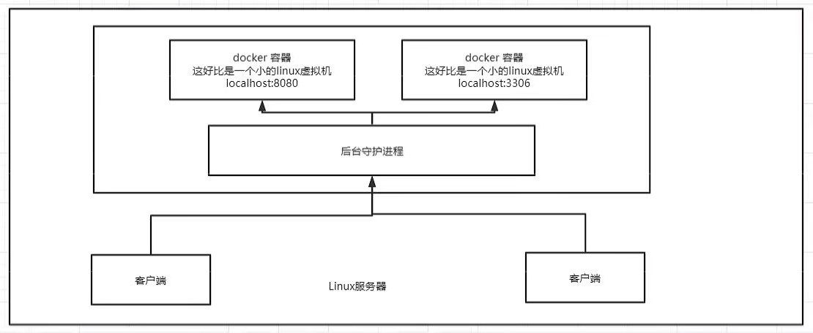
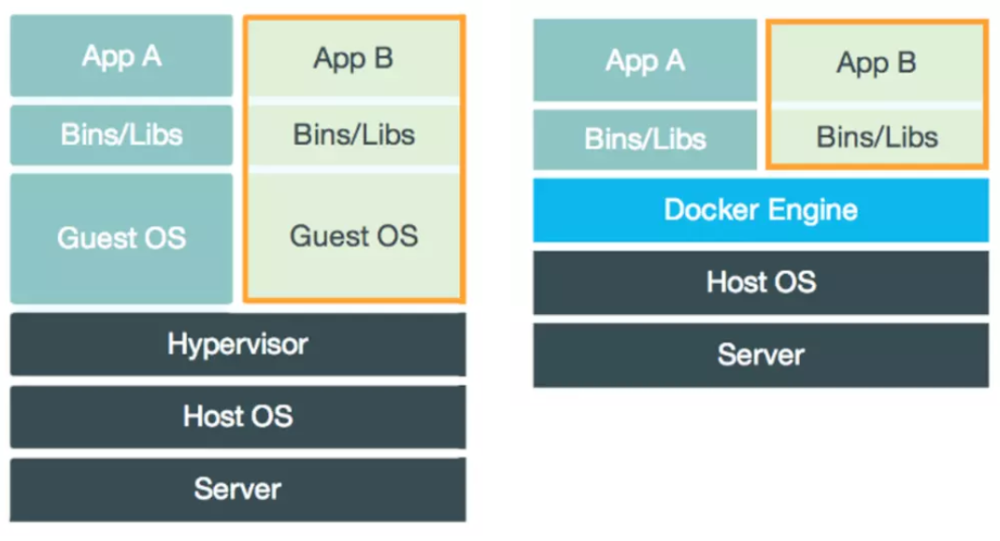

[toc]

# run 流程

# Docker 底层原理

## Docker 是怎么工作的？

> Docker 是一个 Client-Server 结构的系统。Docker 的守护进程运行在主机上。通过 Socket 从客户端访问。
>
> Docker-Server 接收到了来自 Docker-Client 的命令，即会去执行该命令。

## Docker 为什么比 VM 快？

> 1. Docker 有着比 VM 更少的抽象层。
> 2. Docker 利用的是主机的内核，而 VM 需要的是 GuestOS。

> 即，当新建一个虚拟机时，Docker 不需要向虚拟机那样，重新加载一个操作系统内核，避免引导。
>
> 虚拟机是加载 GuestOS。分钟级别的。
>
> Docker 是利于主机的操作系统，省略了这个复杂的过程。是秒级的。

