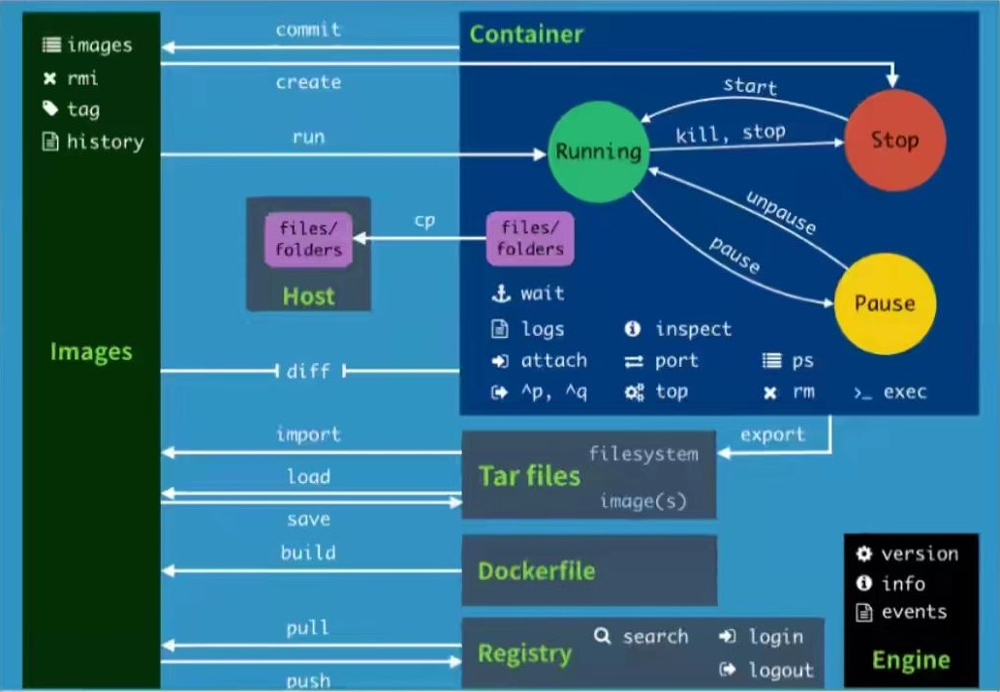

[toc]

# 帮助命令

## 帮助命令

```
docker version		// 查看 Docker 版本信息

docker info			// 查看 Docker 系统信息。包括镜像和容器数量				

docker 命令 --help	// 查看帮助信息
```

## 帮助命令地址

*文档地址：*<https://docs.docker.com/reference/>

