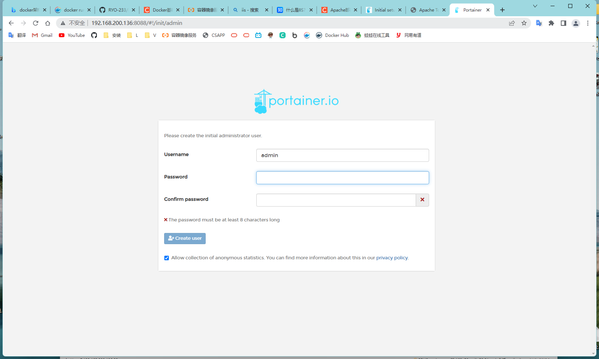

[toc]

# 可视化

## Portainer

### Portainer 是什么？

> Portainer 是一个*图形化界面管理工具*，给我们提供了一个后台管理面板。

### Portainer 的安装

```
docker run -d -p 8088:9000 --restart=always -v /var/run/docker.sock:/var/run/docker.sock --privileged=true portainer/portainer
```

### 访问

```
http://ip:8088
```



## Rancher

