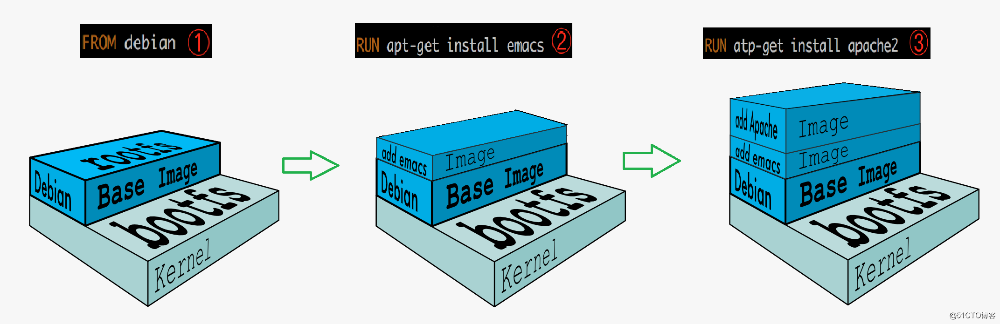
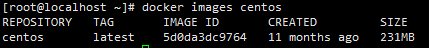
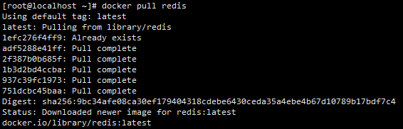
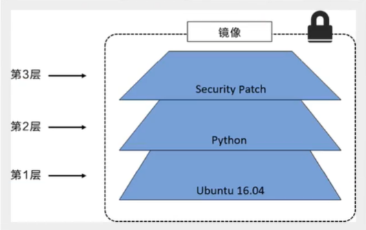
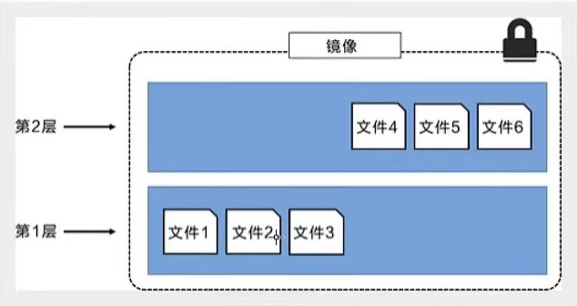
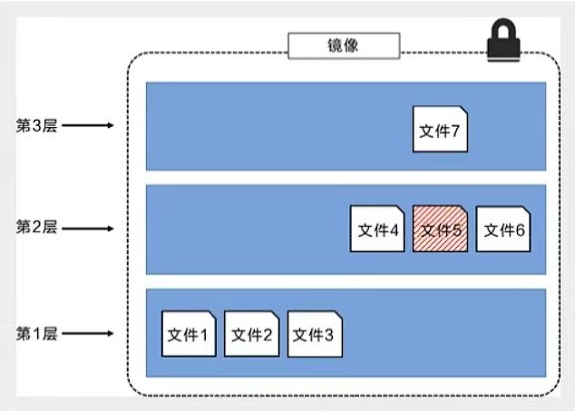
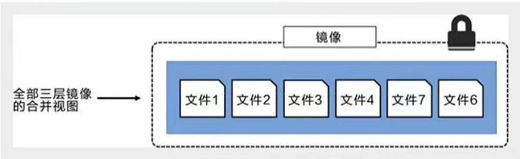

[toc]

# Docker 镜像

## 镜像是什么？

> ​	**镜像**：是一种*轻量级的、可执行的独立软件包*。
>
> ​	它用来打包软件运行环境和基于运行环境开发的软件。它包含了一个软件运行所需要的所有内容，包括代码、运行时、库、环境变量和配置文件。
>
> ​	因此，所有的应用，通过直接打包 Docker 镜像，即可直接运行起来。

### 如何得到 Docker 镜像？

- 从远程仓库中下载。
- 通过拷贝。
- 自己制作一个镜像：DockerFile。

## Docker 镜像加载原理

### UnionFS(联合文件系统)

> ​	UnionFS(联合文件系统)：UnionFS 是一种*__分层__、轻量级且高性能*的**文件系统**。
>
> ​	它支持对文件系统的修改作为一次提交，来一层层的叠加，同时可以将不同目录挂载到同一个虚拟文件系统下(unite several directories into a single virtual filesystem)。**UnionFS 是 Docker 镜像的基础。**

#### UnionFS 的特征：

> ​	一次可以同时加载多个文件系统，但从外面看，只能看到一个文件系统。联合加载会把各层文件系统叠加起来，最终的文件系统会包含所有底层的文件和目录。

---

### Docker 镜像加载原理

> ​	Docker 的镜像实际上是由一层一层的文件系统组成，而这种层级的文件系统即为 **UnionFS**。
>
> ​	**bootfs(boot file system)**：主要包含 bootloader 和 kernel。
> ​		bootloader 主要是引导加载 kernel，Linux 在启动时会加载 bootfs 文件系统。在 Docker 镜像中，最底层的即为 bootfs。
> ​		这一层(bootfs)和我们典型的 Linux / Unix 系统是一样的。包含 boot加载器 和内核。当 boot 加载完成之后，整个内核都在内存中了，此时内存的使用权已由 bootfs 转交给内核，此时系统也会卸载 bootfs。
>
> ​	**rootfs(root file system)**：在 bootfs 之上。
> ​		包含了典型 Linux 系统中的 /dev，/proc，/bin，/etc 等标准目录和文件。
> ​		rootfs 就是各种不同的操作系统发行版。比如：Ubuntu，CentOS 等。

#### 问题：为什么 VM 中 CentOS 好几个G，而 Docker 中只有 几百MB？

> ​	对于一个精简的操作系统，rootfs 可以很小，只需要包含最基本的命令、工具和程序库即可。
>
> ​	因为底层直接用 host 的 kernel，自己只需要提供 rootfs 即可。
>
> ​	由此可见，对于不同的 Linux 发行版， bootfs 基本是一致的，rootfs 会有所差别。
>
> ​	因此，不同的发行版可以公用 bootfs。

## 分层思想

### 分层的镜像

> ​	当下载一个镜像时，通过日志的输出可以发现，镜像是在一层一层的下载。

#### 为什么 Docker 镜像采用分层的结构？

> ​	分层的最大好处，或许莫过于资源的共享了。若有多个镜像，都是从相同的 base 镜像中构建而来，那么宿主机只需要在磁盘上保留一份 base 镜像，同时内存中也只需要加载一份 base 镜像。这样就可以为所有容器服务了，而且镜像的每一层都能被共享。
>
> ​	通过命令可以查看镜像的分层：
> ​		docker image inspect <command>

---

### 分层思想的理解

> ​	所有的 Docker 的镜像都始源于一个基础镜像层。当进行修改或者增加新的内容时，就会在当前镜像层之上，创建新的镜像层。
>
> ​	如下：
> ​		假如基于 Ubuntu16.04 创建一个新的镜像，这就是新的镜像的第一层。
> ​		若在这镜像上添加一个 Python 包，则会在基础镜像层上创建第二个镜像层。
> ​		若再添加一个补丁，则会创建第三个镜像层。

> ​	*在添加额外的镜像层的同时，镜像始终保持着当前所有镜像的组合*。

> ​	这种情况下，上层镜像层的文件会覆盖下层镜像层中的文件。这样就使得文件更新的版本作为一个新的镜像层添加到镜像中。
>
> ​	Docker 通过存储引擎(新版本使用的是快照机制)的方式实现镜像层堆栈，并保证多镜像层对外展示为统一的文件系统。
>
> ​	Linux上可用的存储引擎有 AUFS、Overlay2、Device Mapper、Btrfs 以及 ZFS。每种存储引擎都基于 Linux 中对应的文件系统或者块设备技术，并且每种存储引擎都有其独有的性能特点。
>
> ​	Docker 在 Windows 上仅支持 windowsfilter 存储引擎。该引擎基于 NTFS 文件系统，实现了分层和CoW(Copy on write: 写时复制)。

#### 分层的特征

> ​	Docker 镜像都是只读的。当容器启动时，一个新的可写层被加载到镜像的顶部。
>
> ​	这一层即我们通常所说的容器层，其下的都称为镜像层。
