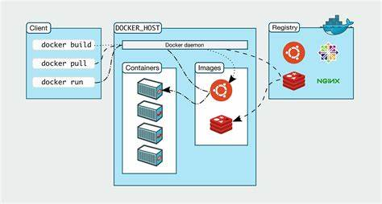

[toc]

# Docker安装

## Docker的基本组成

### 镜像(images)：

> Docker 镜像就如一个模板，可以通过这个模板来创建容器服务。
>
> 如：
> 		tomcat 镜像 -> run(启动镜像) -> tomcatd容器(用来提供服务器)
>
> 通过这个镜像，能够创建多个容器（最终服务运行或项目运行就是在容器中）。

### 容器(Containers):

> Docker 利用容器技术，能够独立运行一个或一组应用，这是通过镜像创建的。可以将容器理解为一个简易的 Linux 系统。
>
> 容器具有启动、停止、删除等基本指令。

### 仓库(Repository):

> 仓库是用来存放镜像的地方。仓库分为公有仓库和私有仓库。
>
> 官方仓库：Docker Hub。国内有阿里云等容器服务器，需要我们配置镜像加速。

## 安装

### 环境查看

~~~
uname -r
// 查看系统环境
cat /etc/os-release
~~~

## 安装

### 1. 卸载旧版本

~~~
yum remove docker \
			docker-client \
			docker-client-latest \
			docker-common \
			docker-latest \
			docker-latest-logrotate \
			docker-logrotate \
			docker-engine
~~~

### 2. 安装必要的安装包

~~~
~~~

